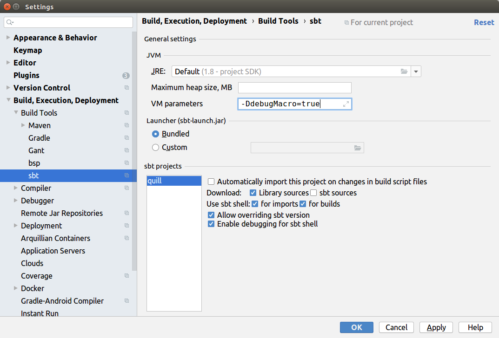
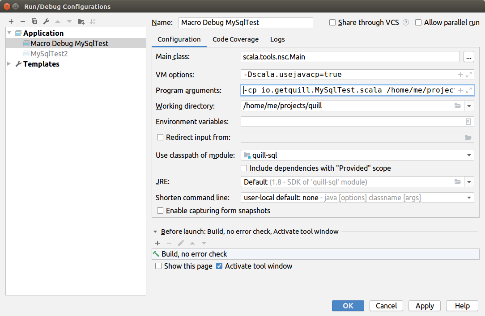
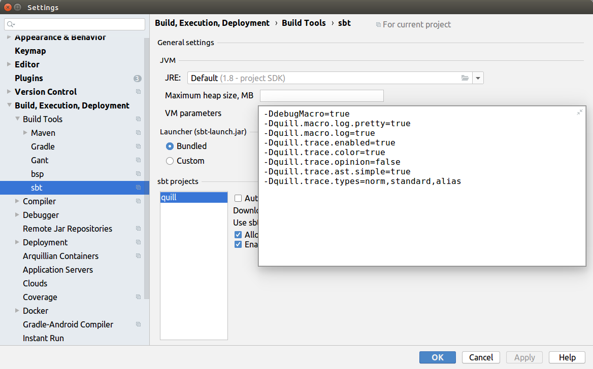

Instructions on how to contribute to Quill project.

## Building the project using Docker

The only dependency you need to build Quill locally is [Docker](https://www.docker.com/).
Instructions on how to install Docker can be found [here](https://docs.docker.com/engine/installation/).

If you are running Linux, you should also install Docker Compose separately, as described
[here](https://docs.docker.com/compose/install/).

After installing Docker and Docker Compose you have to setup databases:

```bash
docker-compose run --rm setup
```

After that you are ready to build and test the project. The following steps describes how to test the project with
sbt built within docker image. If you would like to use your local sbt,
please visit [Building locally](#building-locally-using-docker-only-for-databases). This is highly recommended
when running Docker on non-linux OS due to high IO overhead from running 
[Docker in virtualized environments](https://docs.docker.com/docker-for-mac/osxfs/#performance-issues-solutions-and-roadmap).

To build and test the project:

```bash
docker-compose run --rm sbt sbt test
```

## Building Scala.js targets

The Scala.js targets are disabled by default, use `sbt "project quill-with-js"` to enable them.
The CI build also sets this `project quill-with-js` to force the Scala.js compilation.

## Changing database schema

If any file that creates a database schema was changed then you have to setup the databases again:

```bash
docker-compose down && docker-compose run --rm setup
```

## Changing docker configuration

If `build/Dockerfile-sbt`, `build/Dockerfile-setup`, `docker-compose.yml` or any file used by them was changed then you have to rebuild docker images and to setup the databases again:

```bash
docker-compose down && docker-compose build && docker-compose run --rm setup
```

## Tests

### Running tests

Run all tests:
```bash
docker-compose run --rm sbt sbt test
```

Run specific test:
```bash
docker-compose run --rm sbt sbt "test-only io.getquill.context.sql.SqlQuerySpec"
```

Run all tests in specific sub-project:
```bash
docker-compose run --rm sbt sbt "project quill-async" test
```

Run specific test in specific sub-project:
```bash
docker-compose run --rm sbt sbt "project quill-sqlJVM" "test-only io.getquill.context.sql.SqlQuerySpec"
```

### Debugging tests
1. Run sbt in interactive mode with docker container ports mapped to the host: 
```bash
docker-compose run --service-ports --rm sbt
```

2. Attach debugger to port 15005 of your docker host. In IntelliJ IDEA you should create Remote Run/Debug Configuration, 
change it port to 15005.
3. In sbt command line run tests with `test` or test specific spec by passing full name to `test-only`:
```bash
> test-only io.getquill.context.sql.SqlQuerySpec
```

## Pull Request

In order to contribute to the project, just do as follows:

1. Fork the project
2. Build it locally
3. Code
4. Compile (file will be formatted)
5. Run the tests through `docker-compose run sbt sbt test`
6. If you made changes in *.md files, run `docker-compose run sbt sbt tut` to validate them
7. If everything is ok, commit and push to your fork
8. Create a Pull Request, we'll be glad to review it

## File Formatting 

[Scalariform](http://mdr.github.io/scalariform/) is used as file formatting tool in this project.
Every time you compile the project in sbt, file formatting will be triggered. To manually format
the Quill codebase, run the following command:
```
sbt scalariformFormat test:scalariformFormat
```

## Notes About Git

As you are working on a branch fixing a Quill problem, there will likely be additional changes merged
to the main Quill repo (i.e. getquill/quill) before you finish. The solution to this is to squash your commits, 
and then to replay them on top of the latest changes that have been made to the main Quill repo.

The steps to do that are the following:
1) Squash your commits via an interactive git rebase (see [here](https://medium.com/@slamflipstrom/a-beginners-guide-to-squashing-commits-with-git-rebase-8185cf6e62ec)).
2) If you have not already, add an 'upstream' remote to your repository:
   ```
   git remote add upstream 'git@github.com:getquill/quill.git'
   ``` 
3) Do a git Pull + Rebase from the upstream:
   ```
   git pull --rebase upstream master
   ```

Once you have resolved any conflicts that may have arisen from the rebase, your
branch will be capable of becoming a pull-request.

## Building locally using Docker only for databases

To restart your database service with database ports exposed to your host machine run:

```bash
docker-compose down && docker-compose run --rm --service-ports setup
```

After that we need to set some environment variables in order to run `sbt` locally.

```bash
export CASSANDRA_HOST=127.0.0.1
export CASSANDRA_PORT=19042
export CASSANDRA_CONTACT_POINT_0=127.0.0.1:19042
export CASSANDRA_DC=datacenter1
export MYSQL_HOST=127.0.0.1
export MYSQL_PORT=13306
export MYSQL_PASSWORD=root
export POSTGRES_HOST=127.0.0.1
export POSTGRES_PORT=15432
export POSTGRES_PASSWORD=postgres
export SQL_SERVER_HOST=127.0.0.1
export SQL_SERVER_PORT=11433
export ORIENTDB_HOST=127.0.0.1
export ORIENTDB_PORT=12424
export ORACLE_HOST=127.0.0.1
export ORACLE_PORT=11521
```

Where `127.0.0.1` is address of local docker.
If you have non-local docker change it depending on your settings.

Finally, you can use `sbt` locally.

### All In One ###

To restart the database services, rebuild them, and start with locally explosed ports run:

docker-compose down && docker-compose build && docker-compose run --rm --service-ports setup

Note: Make sure you have exposed all the ports as mentioned above.

## Debugging using Intellij

[Intellij](https://www.jetbrains.com/idea/) has a comprehensive debugger that also works with macros which is very
helpful when working on Quill. There are two ways to debug Quill macros using Intellij. The first way is to launch SBT in 
debug mode and use Intellij to remote debug it. The second way is to launch a debug session 
from Intellij from the "Run/Debug Configurations" menu.

### Debug Macros by Remote Debugging SBT

In order to use the debugger you need to run sbt manually so follow the instructions 
[here](#building-locally-using-docker-only-for-databases) first. After this you need to edit `build.sbt` to disable
forking when running tests, this is done by changing `fork := true` to `fork := false` for the tests you want to run.

After this you need to launch sbt with `sbt -jvm-debug 5005`. Note that since the JVM is no longer forked in tests its
recommended to launch sbt with additional memory, i.e. `sbt -jvm-debug 5005 -mem 4096` otherwise sbt may complain about
having memory issues.

Then in Intellij you need to
[add a remote configuration](https://www.jetbrains.com/help/idea/run-debug-configuration-remote-debug.html). The default
parameters will work fine (note that we started sbt with the debug port `5005` which is also the default debug port
in Intellij). After you have added the configuration you should be able to start it to start debugging! Feel to free
to add breakpoints to step through the code.

Note that its possible to debug macros (you can even
[evaluate expressions](https://www.jetbrains.com/help/idea/evaluating-expressions.html) while paused inside a macro),
however you need to edit the macro being executed after every debug run to force the macro to recompile since macro
invocations are cached on a file basis. You can easily do this just by adding new lines.

### Debug Macros by Launching a Session

Firstly, you will need to build Quill with some additional dependencies that include the file `scala.tools.nsc.Main`.
You can do this adding the argument `-DdebugMacro=true` to the sbt launcher. You can do this in the Intellij SBT
menu:



In Intellij, go to `Run -> Edit Configurations...` click on the Plus (i.e. `+`) button (or `Add New Configuration`) 
and select `Application`. Then enter the following settings:

```
Main Class: scala.tools.nsc.Main
VM Options: -Dscala.usejavacp=true
Program Arguments: -cp io.getquill.MySqlTest.scala /home/me/projects/quill/quill-sql/src/main/scala/io/getquill/MySqlTest.scala
Use classpath of module: quill-sql
Before launch:
Build, no error check (make sure to set this since you will frequently want to debug the macros even if the build fails)
```

It should look like this:


> NOTE In this example, our entry-point into Quill-macro-debugging is `MySqlTest.scala`.
> In our Intellij application configuration this file name is being explicitly specified.<br /> 
> If you wish to easily be able to macro-debug multiple entry-point files, an alternative method would be to
> use some Intellij variables to automatically pass whatever file is currently selected. You can do this by using
> the configuration:
> ```
> -cp $FileFQPackage$$FileName$ $FilePath$
> ```
> Also, instead of specifying the path segment `/home/me/projects/quill/` you can use `$ProjectFileDir$`

Then create a file `quill-sql/src/main/scala/io/getquill/MySqlTest.scala` that has the code you wish to debug.
For example:
```scala
object MySqlTest {

  val ctx = new SqlMirrorContext(PostgresDialect, Literal)
  import ctx._

  case class Person(name: String, age:Int)

  def main(args:Array[String]):Unit = {    
    val q = quote {
      query[Person].filter(p => p.name == "Joe")
    }
    println( run(q).string )
  }
}
```

Set a breakpoint anywhere in the Quill codebase and run this configuration from the top-right menu shortcut:


## Additional Debug Arguments

Some additional arguments you can add to your compiler's VM args provide insight into Quill's compilation:

```
-DdebugMacro=true                              // Enables libraries needed to debug via an Intellij Application session (default=false)
-DexcludeTests=false                           // Excludes testing code from being build. Useful during development times that require rapid iteration
-Dquill.macro.log.pretty=true                  // Pretty print the SQL Queries that Quill produces (default=false)
-Dquill.macro.log=true                         // Enable/Disable priting of the SQL Queries Quill generates during compile-time (default=true)
-Dquill.trace.enabled=true                     // Global switch that Enables/Disables printing of Quill ASTs during compilation (default=false)
-Dquill.trace.color=true                       // Print Quill ASTs in color (default=false) 
-Dquill.trace.opinion=false                    // Print the parts of Quill ASTs not directly used in the main transformation phases (called Opinions).  (default=false) 
-Dquill.trace.ast.simple=true                  // Print the raw Quill ASTs elements or a more compact view of the AST code (think `show` vs `showRaw` in Scala macros). (default=true) 
-Dquill.trace.types=sql,standard,alias,norm    // What parts of the Quill transformations to print during compilation?
```

In Intellij, add them in the SBT settings if your are compiling using SBT:


## 'Trick' Debugging via the Dynamic Query API

Since typically the Quill Query Normalizations and Tokenizations run during compile-time,
break-point debugging them requires one of the above two steps. However, you can 'trick'
Quill into running these during compile time by using the `.dynamically` keyword.

For example say you have a query that looks like this, and you would like to see
what happens to the AST in the `ExpandDistinct` phase.
```scala
val q = quote { query[Person].distinct.map(p => p.name) }
val output = run(q)
```
Change the quotation to be dynamic:
```scala
val output = run(q.dynamically)
```
Since the query is now dynamic, you can set a breakpoint in the ExpandDistinct
class and it will be hit during the runtime of your application.

#### Alternate Method

In situations where the .dynamically keyword is not available, e.g. when the 
quoted construct is not a query, add a type annotation to the variable holding the
quotation and this will effectively cause the same behavior.

```scala
val q = quote { query[Person].distinct.map(p => p.name) }
val output = run(q)
```
Add a type annotation which will cause it to be dynamic
```scala
val q: Quoted[Query[String]] = quote { query[Person].distinct.map(p => p.name) }
```
Same as before, since the query is now dynamic, you can set a breakpoint in the ExpandDistinct
class and it will be hit during the runtime of your application.
